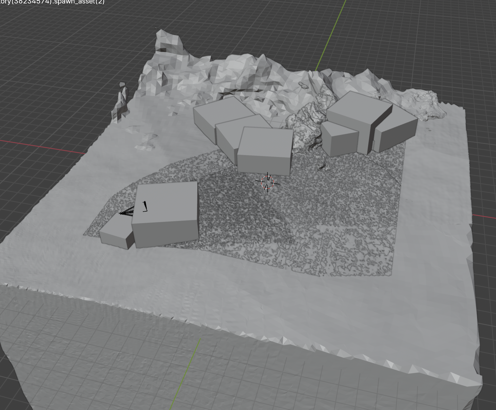
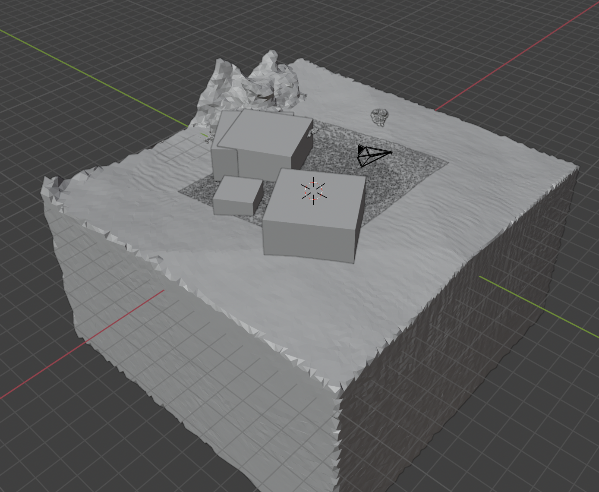
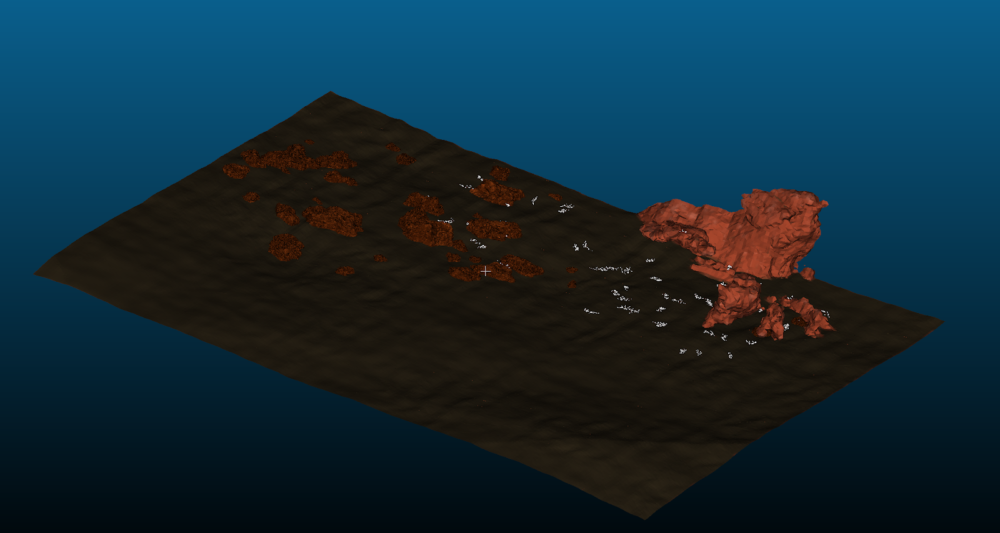

# 🌊 Generating Underwater 3D Scenes with Infinigen

This project's summary aims to provide an understanding of how to generate high-quality underwater 3D scenes with [Infinigen](https://github.com/princeton-vl/infinigen) and integrate them into simulation environments. Moreover, we focus on scene generation on a local device,  i.e. with limited computing capacity.

---

## 📁 Project Overview

- **Goal**: Automatically generate photorealistic underwater scenes (kelp forests, coral reefs, canyons) for simulation and ML applications.
- **Tooling**: Infinigen + Blender + (SLURM Cluster + Docker) + MeshCat Simulator + CloudCompare
- **Focus**: Parameter tuning with `.gin` config files, scene export to `.obj`, and simulator integration.

---

## 🛠️ Setup & Installation

### Prerequisites

- Python 3.11  
- CUDA GPU or Metal (on macOS)  
- FFmpeg for video rendering  
- Disk space: >20GB recommended (a scene can become >15GB after export to `.obj` --> choose scene parameters wisely)

### Setup

First, clone the repo and set up a conda environment (you may need to [install conda](https://conda.io/projects/conda/en/latest/user-guide/install/index.html))
```bash
git clone https://github.com/princeton-vl/infinigen.git
cd infinigen
conda create --name infinigen python=3.11
conda activate infinigen
```

Then, install the infinigen package using one of the options below:

_Option 1: (Python model)_
```bash
# Full install (Terrain & OpenGL-GT enabled, needed for Infinigen-Nature HelloWorld)
pip install -e ".[terrain,vis]"
```

OR

_Option 2: (Blender Python script)_
```bash
# Enable OpenGL GT (WITH interactive Blender)
INFINIGEN_INSTALL_CUSTOMGT=True bash scripts/install/interactive_blender.sh
```

For more details follow the installation guide: https://github.com/princeton-vl/infinigen/blob/main/docs/Installation.md
Note that we worked in the following with _Option 1_.
### Cluster (SLURM) & Docker
- Installation (https://github.com/princeton-vl/infinigen/blob/main/docs/Installation.md#using-infinigen-in-a-docker-container)
- Docker is used for GPU access inside the cluster.  
- CUDA setup inside container is required for GPU rendering.

---

## 🧪 Scene Generation Pipeline

We used two primary scripts:

- `generate_nature.py`: Standalone pipeline  
- `manage_jobs.py`: Batch job control on cluster  

Each scene uses a chain of Gin-configurable stages:

```python
compose_nature  # Layout objects (empty placeholders)
populate_scene  # Replace placeholders with assets
```

that are both defined within `infinigen\infinigen_examples\generate_nature.py`.

### Example command:

```bash
python -m infinigen.datagen.manage_jobs \
  --output_folder outputs/kelp_forest_world \
  --num_scenes 1 \
  --configs kelp_forest.gin \
  --pipeline_configs local_16GB.gin monocular_video.gin \
  --pipeline_overrides LocalScheduleHandler.use_gpu=False
```
Note, if you have a local GPU, set `LocalScheduleHandler.use_gpu=True`.

---

## ⚙️  Gin Configuration Insights

If you have never worked with Gin file configuration before, you should know that it is really powerful. It simply allows you to modify any parameters in all scripts that you are calling. How does it work?

You import gin and you mark the functions or classes that you want to modify later with an `@gin.configurable`:

```bash
import gin

@gin.configurable
def compose_nature(output_folder, scene_seed, **params):

	p = pipeline.RandomStageExecutor(scene_seed, output_folder, params)
	
	...
```


In order to understand the modification mechanism better, you should know that the `compose_nature` file is a stacking of all possible generations in form of the `RandomStageExecutor`. In a stage you define first the code that is executed and can modify parameters. Important to note is that the name of the stage is the first argument (string). Here we provide you an example for the kelp asset:

```python
def add_kelp(terrain_mesh):
    fac = monocot.KelpMonocotFactory(int_hash((scene_seed, 0)), coarse=True)

    selection = density.placement_mask(scale=0.05, tag=underwater_domain)

    placement.scatter_placeholders_mesh(
        terrain_mesh,
        fac,
        altitude=-0.05,
        overall_density=params.get("kelp_density", uniform(0.2, 1)),
        selection=selection,
        distance_min=3,
    )

p.run_stage("kelp", add_kelp, terrain_mesh)
```

Now, we want to take you one layer deeper inside the `RandomStageExecutor`. The executor only executes the stage if the scene fulfils given prerequisites and in case of a given likeliness 
`f"{name}_chance"` (last condition/paragraph):


```python
def _should_run_stage(self, name, use_chance, prereq):
    if prereq is not None:
        try:
            e = next(e for e in self.results if e["name"] == prereq)
        except StopIteration:
            raise ValueError(f"{self} could not find matching name for {prereq=}")
        if not e["ran"]:
            logger.info(f"Skipping run_stage({name}...) due to unmet {prereq=}")
            return

    with FixedSeed(int_hash((self.scene_seed, name, 0))):
        if not self.params.get(f"{name}_enabled", True):
            logger.debug(f"Not running {name} due to manually set not enabled")
            return False

        if use_chance and np.random.uniform() > self.params[f"{name}_chance"]:
            logger.debug(f"Not running {name} due to random chance")
            return False

    return True

```

This is the most crucial part for modifying the appearance of a scenes. We modify the probability of objects, animals and other scene attributes to appear. We can also put constraints to the water, e.g. if we want to simulate waves or not, or the camera(s) by limiting their trajectory.

```gin
compose_nature.kelp_chance = 1.0
compose_nature.creatures_chance = 0.0
compose_nature.fish_school_chance = 0.3
water.geo.with_waves=False
camera.camera_pose_proposal.pitch = ("clip_gaussian", 90, 15, 60, 140)
```

See `configs/scene_types/under_water.gin` and `kelp_forest.gin` for full setups.

---

## ⚙️ Key Gin Parameters


---

## 🧱 Troubleshooting & Insights

When playing around with all the possible parameters and configurations, you will run into different issues. To give you a hand full of fixes for the beginning, we provide you with a short list of things that came us across.

| Problem | Cause | Fix |
|--------|-------|-----|
| `RuntimeError: No space left on device` | Blender failed to save `.blend` | Clear disk space |
| Kelp scene crashing | Low `kelp_chance` (e.g. 0.7) | Use `kelp_chance = 1.0` |
| Camera sees placeholders only | Blender camera was moved manually | Re-run scene with new camera pose |
| Massive `.obj` files (20GB+) | Too many assets or large bounds | Reduce resolution & bounding box |
| Objects black in simulator | Missing textures or shading | Export only with vertex color; simplify mesh |
| `"Could not find 1 camera views"` | Bounds too small | Increase `Terrain.bounds` and camera range |

---

## 📦 Exporting to External Simulators

After a scene generation by above mentioned code, you will end up with `.blend` files and ground truth data. However, you may be interested in loading your scene in a simulator and most likely you will have to convert your file format. We chose for the `.obj` format, because it is widely used and allows a great 

Export `.blend` to `.obj`:

```bash
python -m infinigen.tools.export \
  --input_folder outputs/kelp_forest_world/0/fine \
  --output_folder exports/kelp_forest \
  -f obj -r 256
```

`-r` allows you to modify the resolution of the linked texture maps (in our example: 256x256).
For more details and export options take a look into the original documentation: 
https://github.com/princeton-vl/infinigen/blob/main/docs/ExportingToExternalFileFormats.md

**Tips**:
- Remove atmospheric objects from `.blend` before export. (blocks the detailed structure of the scene to be perceived in a similator) 

	We inserted this snippet at the end of the `infinigen.infinigen.tools.export.delete_objects()` function, in order to remove any disturbing assets: 
```python
# Remove any object with atmosphere/emitter in name

for obj in list(bpy.data.objects):

name = obj.name.lower()

if "atmosphere" in name or "emitter" in name or "cloud" in name or "liquid" in name:

print(f"Removing object: {obj.name}")

bpy.data.objects.remove(obj, do_unlink=True)
```

- Exporting low-asset scenes reduces file size significantly. (assets carry a lot of data, e.g. texture and complex structure)
  
	We modified the `simple.gin` and limited the terrain bounds in order to generate fewer assets.

```gin
include 'infinigen_examples/configs_nature/performance/dev.gin'
include 'infinigen_examples/configs_nature/disable_assets/no_creatures.gin'
include 'infinigen_examples/configs_nature/performance/fast_terrain_assets.gin'

run_erosion.n_iters = [1, 1]  

configure_render_cycles.num_samples = 100

Terrain.bounds = (-5, 5, -5, 5, -5, 5)
Terrain.populated_bounds = (-5, 5, -5, 5, -5, 5)

```


<table style="width:100%; table-layout:fixed;">
  <tr>
    <td style="width:50%; text-align:center;">
      <figure>
        
        <figcaption>Figure 1: bounds = 15, populated_bounds = 10</figcaption>
      </figure>
    </td>
    <td style="width:50%; text-align:center;">
      <figure>
        
        <figcaption>Figure 2: bounds = 10, populated_bounds = 5</figcaption>
      </figure>
    </td>
  </tr>
</table>


You have to add this `.gin`file when calling the scene generation, e.g.

```batch
python -m infinigen.datagen.manage_jobs \  
--output_folder outputs/under_water_even_smaller \  
--num_scenes 1 \
--specific_seed 0 \
--configs coral_reef.gin <name_of_config_file_above>.gin \
--pipeline_configs local_16GB.gin static.gin \
--pipeline_overrides LocalScheduleHandler.use_gpu=False
 ```

❗️Caution:

When reducing the bounds of the scene too much, you mess up with the constraints and have to modify them so that they stay within the bounds of the scene.

```gin
multi_mountains_params.height = ("uniform", 0.3, )
multi_mountains_params.min_freq = ("uniform", 0.01, 0.015)
multi_mountains_params.max_freq = ("uniform", 0.03, 0.06)

keep_cam_pose_proposal.terrain_coverage_range = (0.3, 1)
camera.camera_pose_proposal.altitude = ("clip_gaussian", 0.3, 0.7, 2, 1)
camera.camera_pose_proposal.pitch = ("clip_gaussian", 90, 15, 60, 110)
```

---

## 🧭 Simulator Integration
- Sanity-check in CloudCompare if the scenes are properly exported 
<figure style="text-align:center;">
  
</figure>
- Tested with **Stonefish** and **Bluerov2 Gym (Meshcat)**, only very small/low-asset scenes (<1GB file size)
- Exported `.obj` or `.dae` files are loaded, but complex scenes (high asset density) may break visualization

---

## 🧠 Insights

- Infinigen is highly modular; each scene is generated by stages driven by `RandomStageExecutor`.
- The chance-based system lets you probabilistically include elements.
- The main tradeoff is between visual richness and output manageability (render time, file size).

---

## 🎥 Rendering & Videos

If you do not modify the standard pipeline of `manage_jobs.py`, you will first create a coarse version then a fine version of the scene and finally the code will execute a rendering of all frames of the initialised camera. Are you interested in making a clip out of the frames?
Use FFmpeg to convert frames in a short clip:

```bash
ffmpeg -framerate 30 -i %04d.png -c:v libx264 -pix_fmt yuv420p output.mp4
```

---

## 📈 Optimizing for Speed

Use `static.gin` with:

```gin
iterate_scene_tasks.frame_range = [1, 1]
iterate_scene_tasks.render_frame_range = [1, 1]
```

This reduced rendering time from 15 min → 2 min.

Note that in this case you are more/only interested in generating a scene (`.blend`) than in generating consecutive frames sampled from the cameras.

---

## 📎 References

- [Infinigen GitHub](https://github.com/princeton-vl/infinigen)  
- [GIN Config Library](https://github.com/google/gin-config)  
- [Exporting to External Formats](https://github.com/princeton-vl/infinigen/blob/main/docs/ExportingToExternalFileFormats.md)  
- [Bluerov2 Gym (Meshcat)](https://github.com/gokulp01/bluerov2_gym)
